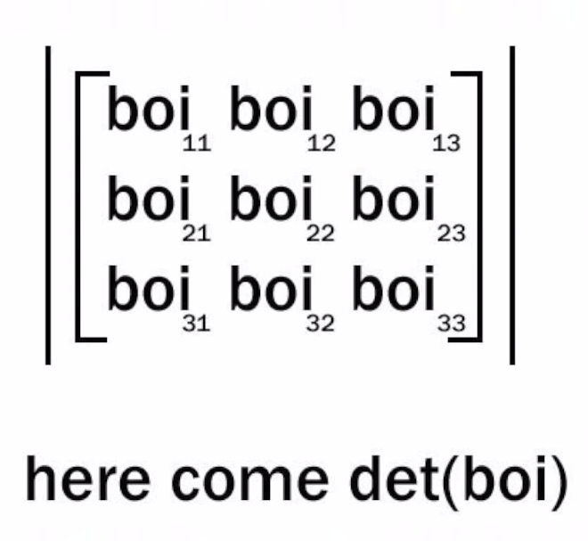

# Welcome!

<!-- [Foo](foo.md) -->

<!-- [About](content/about.md) -->

<!--  -->

<!--  -->

<!--  -->

<!--  -->

My name is Adam Trizuljak. Aside from my regular SW engineering work, I like to work on various hobby projects involving Arduino, ESP8266 & ESP32, STM32, electronics design, 3D printing and more. 
<!-- I have built several mobile robots, WiFi-connected sensors,  -->

This page is a quick showcase of some of my past projects. Where possible, I'll provide links to public Git repos or other means of documentation. Let's go!

# ESP8266 & ESP32

## CO2 and air quality sensor
This is a box with an MH-Z19B CO2 concentration sensor and ZH03B air particulate sensor. I use it to measure indoor air quality.
- Powered by ESP8266 D1 Mini board, programmed in Arduino IDE
- OLED screen shows current sensor readings
- Data streamed to ThingSpeak REST API over WiFi
- Hosts local web server with real-time sensor readings (websockets) and graphs from ThingSpeak

## Neopixel glasses
Sunglasses with an 18 by 7 matrix of WS2812-2020 addressable LEDs.
- Powered by ESP32 with FreeRTOS
- Microphone module with MAX9814 auto-gain pre-amplifier, sampled at 40kHz by ADC using the I2S peripheral with DMA
- Real-time audio processing with FFT and beat detection. Audio processing task is pinned to the second ESP32 core.
- BMI270 6-axis IMU for motion sensing (animations can react to head movements)
- Modular system for LED effects. Currently there are 9 effects including spectrum analyzer, rainbow gradient, scrolling text, glitter, pulsing hearts and googly eyes (reacts to head movement)
- LED PCB designed in KiCad

I want to keep adding more features once events and festivals are allowed again, including a WiFi control interface, the possibility to control the LEDs over DMX/ArtNet, and of course more LED effects and animations.

<!-- pool temp sensor

wifi monitor

# Arduino & Electronics
doppler module

luxmeter

thermal printer

# Robotics
ADIS driver

mprojbot

stm linefollower

# Research
circular avoidance -->