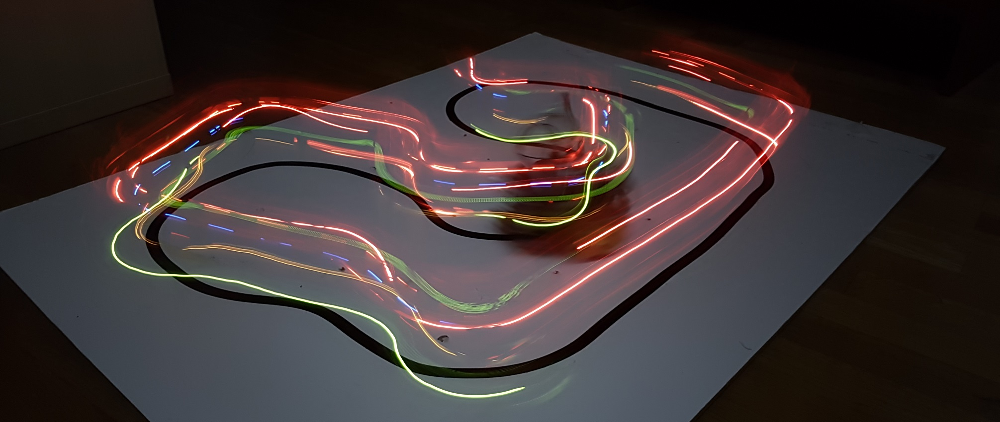

# Welcome!

My name is Adam Trizuljak. Aside from my regular SW engineering work, I like to work on various hobby projects involving Arduino, ESP8266 & ESP32, STM32, electronics design, robotics, 3D printing and more. 

This page is a quick showcase of some of my past projects in different categories, including both hobby projects and course work / research. Where possible, I'll provide links to public Git repos or other means of documentation.

## [ESP8266, ESP32 and IoT projects](iot.md)

## [Arduino & Electronics](embedded.md)

## [Robotics](robotics.md)

Some of my other projects (and many random videos) can be seen on my [Youtube channel](https://www.youtube.com/user/3zuli/videos). I also have a couple of 3D designs on [Thingiverse](https://www.thingiverse.com/3zuli/designs).

