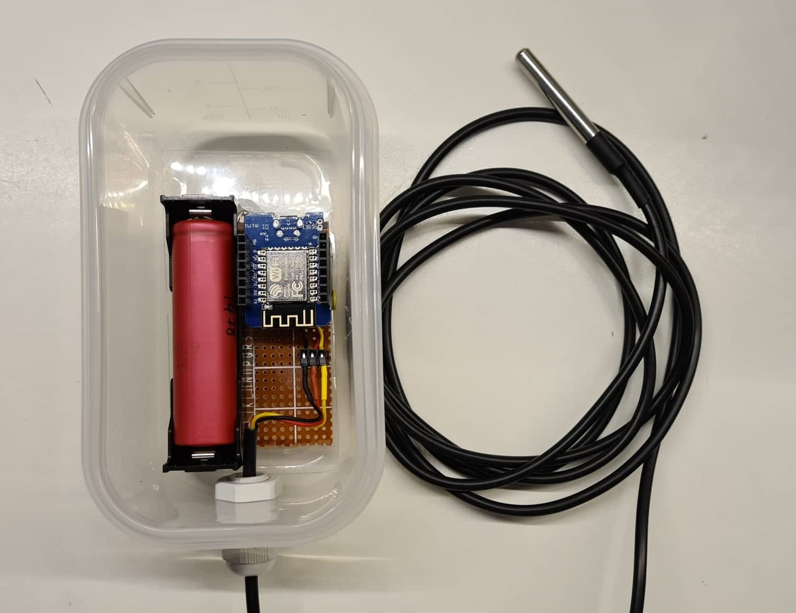

# Welcome!

<!-- [Foo](foo.md) -->

<!-- [About](content/about.md) -->

<!--  -->

<!--  -->

<!--  -->

<!--  -->
<!--  -->

My name is Adam Trizuljak. Aside from my regular SW engineering work, I like to work on various hobby projects involving Arduino, ESP8266 & ESP32, STM32, electronics design, 3D printing and more. 
<!-- I have built several mobile robots, WiFi-connected sensors,  -->

This page is a quick showcase of some of my past projects. Where possible, I'll provide links to public Git repos or other means of documentation. Let's go!

# ESP8266 & ESP32

## IoT CO2 and air quality sensor
2019 - present

This is a box with an MH-Z19B CO2 concentration sensor and ZH03B air particulate sensor. I use it to measure indoor air quality.
- Powered by ESP8266 D1 Mini board, programmed in Arduino IDE
- OLED screen shows current sensor readings
- Data streamed to ThingSpeak REST API over WiFi
- Hosts local web server with real-time sensor readings (websockets) and plots from ThingSpeak

## Neopixel glasses
2019 - present

Sunglasses with an 18 by 7 matrix of WS2812-2020 addressable LEDs.
- Powered by ESP32 with FreeRTOS
- Microphone module with MAX9814 auto-gain pre-amplifier, sampled at 40kHz by ADC using the I2S peripheral with DMA
- Real-time audio processing with FFT and beat detection. Audio processing task is pinned to the second ESP32 core.
- BMI270 6-axis IMU for motion sensing (animations can react to head movements)
- Modular system for LED effects. Currently there are 9 effects including spectrum analyzer, rainbow gradient, scrolling text, glitter, pulsing hearts and googly eyes (reacts to head movement)
- Custom LED PCB designed in KiCad
- Control unit built into a powerbank case - integrated 18650 battery holder and USB charger and it also fits into a pocket

I want to keep adding more features once events and festivals are allowed again, including a web control interface, the possibility to control the LEDs over DMX/ArtNet, and of course more LED effects and animations. I also plan to publish the code and design files on GitHub.

First test showing the LED PCB in detail

## IoT Pool temperature sensor
2021

Quick and dirty temperature monitor for my pool which I made in summer 2021. Uses a waterproof DS18B20 temperature sensor and an ESP8266.
- Wakes up every 5 minutes and sends data to ThingSpeak over MQTT
- Uses the ESP deep sleep mode, lasts approx. 45 days on an old 18650 battery
- Dashboard with temperature plots hosted on ThingSpeak
- Air-tight food containers can be used as good outdoor enclosures :)

## Internet connection monitor
2016

This is an old project. An ESP8266 periodically checks if it's connected to the internet and when not, it flashes a red warning strobe.

[GitHub repository](https://github.com/3zuli/esp_internet_alarm)

[DIY guide on Instructables](https://www.instructables.com/ESP8266-Internet-Alarm/)

# Arduino & Electronics
## HB-100 doppler module
2016

I designed a pre-amplifier board for an HB-100 doppler radar module and made a simple Arduino sketch to measure the doppler frequency and convert it to a speed measurement, which is then shown on a display. The PCB was designed in Eagle and made with the toner transfer method.

[GitHub repository](https://github.com/3zuli/HB100_test)

## Arduino luxmeter
2016-17

I made a luxmeter using an BH1750 light level sensor and an Arduino Pro Mini. The original prototype was built on a prototype board, later I designed a proper PCB in KiCad as a project for our university PCB design class.

[GitHub repository](https://github.com/3zuli/luxmeter)

[DIY guide on Instructables](https://www.instructables.com/Mini-Arduino-Lux-Meter/)

Custom designed PCB:

<!-- # Robotics -->
<!-- ADIS driver -->

<!-- mprojbot -->

<!-- stm linefollower -->

<!-- # Research -->
<!-- circular avoidance -->

<!-- crane control -->