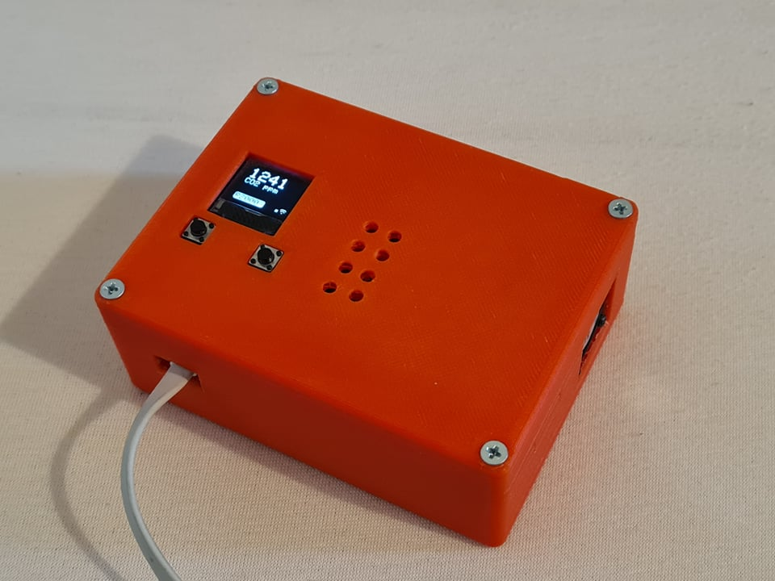
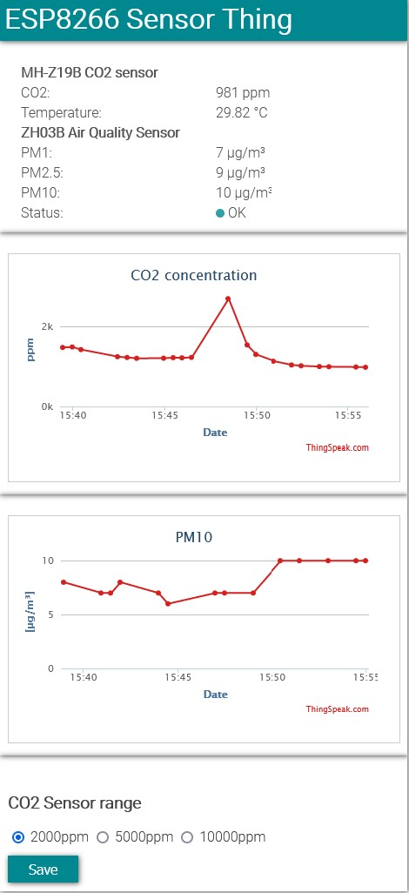
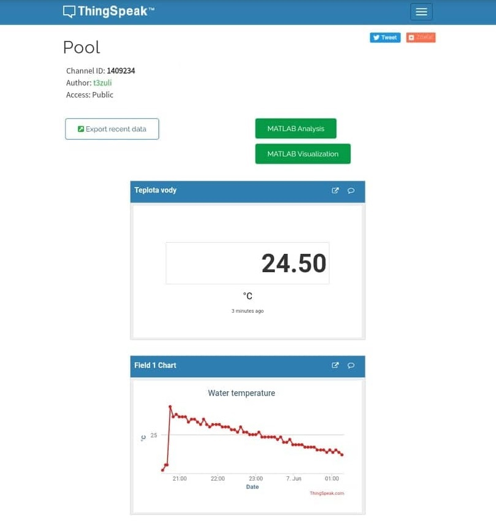

# Welcome!

My name is Adam Trizuljak. Aside from my regular SW engineering work, I like to work on various hobby projects involving Arduino, ESP8266 & ESP32, STM32, electronics design, robotics, 3D printing and more. 

This page is a quick showcase of some of my past projects. Where possible, I'll provide links to public Git repos or other means of documentation. Some of my other projects (and many random videos) can be seen on my [Youtube channel](https://www.youtube.com/user/3zuli/videos). I also have a couple of 3D designs on [Thingiverse](https://www.thingiverse.com/3zuli/designs). Let's go!

# ESP8266 & ESP32

## IoT CO2 and air quality sensor
2019 - present

This is a box with an MH-Z19B CO2 concentration sensor and ZH03B air particulate sensor. I use it to measure indoor air quality.
- Powered by ESP8266 D1 Mini board, programmed in Arduino IDE
- OLED screen shows current sensor readings
- Data streamed to ThingSpeak REST API over WiFi
- Hosts local web server with real-time sensor readings (websockets) and plots from ThingSpeak

## Neopixel glasses
2019 - present

Sunglasses with an 18 by 7 matrix of WS2812-2020 addressable LEDs.
- Powered by ESP32 with FreeRTOS
- Microphone module with MAX9814 auto-gain pre-amplifier, sampled at 40kHz by ADC using the I2S peripheral with DMA
- Real-time audio processing with FFT and beat detection. Audio processing task is pinned to the second ESP32 core.
- BMI270 6-axis IMU for motion sensing (animations can react to head movements)
- Modular system for LED effects. Currently there are 9 effects including spectrum analyzer, rainbow gradient, scrolling text, glitter, pulsing hearts and googly eyes (reacts to head movement)
- Custom LED PCB designed in KiCad
- Control unit built into a powerbank case - integrated 18650 battery holder and USB charger and it also fits into a pocket

I want to keep adding more features once events and festivals are allowed again, including a web control interface, the possibility to control the LEDs over DMX/ArtNet, and of course more LED effects and animations. I also plan to publish the code and design files on GitHub.

First test showing the LED PCB in detail

## IoT Pool temperature sensor
2021

Quick and dirty temperature monitor for my pool which I made in summer 2021. Uses a waterproof DS18B20 temperature sensor and an ESP8266.
- Wakes up every 5 minutes and sends data to ThingSpeak over MQTT
- Uses the ESP deep sleep mode, lasts approx. 45 days on an old 18650 battery
- Dashboard with temperature plots hosted on ThingSpeak
- Air-tight food containers can be used as good outdoor enclosures :)

## Internet connection monitor
2016

This is an old project. An ESP8266 periodically checks if it's connected to the internet and when not, it flashes a red warning strobe.

[GitHub repository](https://github.com/3zuli/esp_internet_alarm)

[DIY guide on Instructables](https://www.instructables.com/ESP8266-Internet-Alarm/)

# Arduino & Electronics
## HB-100 doppler module
2016

I designed a pre-amplifier board for an HB-100 doppler radar module and made a simple Arduino sketch to measure the doppler frequency and convert it to a speed measurement, which is then shown on a display. The PCB was designed in Eagle and made with the toner transfer method.

[GitHub repository](https://github.com/3zuli/HB100_test)

## Arduino luxmeter
2016-17

I made a luxmeter using an BH1750 light level sensor and an Arduino Pro Mini. The original version was built on a prototype board, later I designed a proper PCB in KiCad as a project for our university PCB design class.

[GitHub repository](https://github.com/3zuli/luxmeter)

[DIY guide on Instructables](https://www.instructables.com/Mini-Arduino-Lux-Meter/)

Custom designed PCB:

# Robotics

## Swarm of Crazyflie 2.0 quadcopters
2016, Bachelor thesis, Internship at DLR Robotics and Mechatronics Center, Germany.

I created the basic infrastructure for control of a swarm of miniature semi-autonomous Crazyflie 2.0 quadcopters and for obtaining measurements from on-board sensors. A PD position controller and a new quaternion-based PD attitude controller were implemented in firmware. In addition, I implemented a set of programs for communicating with the quadcopters and for sending simple trajectories. The poses of all drones are measured with a Vicon motion tracking system. The quadcopters only receive their current position and a desired position setpoint. The quadcopters have the ability to detect collisions and landings and are capable of flight in turbulent airflow.

## ADIS16488 IMU driver for Teensy 3.6
2017

Our university mobile robotics team was working on a four-wheeled robot, for which we wanted to integrate the highly precise (and very expensive) Analog Devices ADIS16488 9-axis IMU. I forked an existing [driver for ADIS16448](https://github.com/juchong/ADIS16448-Arduino-Teensy) and modified it for the ADIS16488. The code runs on a Teensy 3.6 board, which reads raw data from the IMU and streams it to the host PC. Other members of the team designed a PCB for the IMU and the Teensy and implemented a ROS node that received data from the Teensy.

[GitHub repository](https://github.com/3zuli/ADIS16488_regtest)

## PID motor control for differential drive robot
2018

This was a team project aimed at creating a line follower robot for the [Istrobot](http://www.robotika.sk/contest/) competition. My role was to develop the firmware for the STM32 processor, which performs low-level PID speed control of the drive motors.
- STM32F411, firmware developed with STM32 Cube IDE
- Two DC geared motors with hall effect encoders, ultrasonic sensor, front bumper switch
- Raspberry Pi uses camera to find the line and sends motion commands to the STM
- STM reads encoders with timers in encoder mode, performs a PID control loop for each motor, sends odometry and sensor states to RPi

[GitHub repository](https://github.com/3zuli/mprojbot)

[Project report](https://github.com/3zuli/mprojbot/blob/master/doc/MPROJ_robot_dokumentacia.pdf) (pdf, Slovak only)

## PID control of model gantry crane
2017

Assignment for our Mechatronic system control course. The project was realized using Matlab and Simulink. The work consisted of
- Performing system identification of the crane to create a simulation model
- Using the simulation model to design and tune a controller in simulation
- Using the developed controller to control the physical crane

## STM32 Line follower
2017

My own attempt at building a line follower robot for the [Istrobot 2017](http://www.robotika.sk/contest/2017/index.php) competition.
- STM32L152, firmware developed using [mbed.com](mbed.com)
- Line following with 9x CNY70 sensor (custom PCB) and PID control
- Ultrasonic sensor and front bumper switch for detecting obstacles
- Magnetometer for heading control while avoiding an obstacle

The actual line following worked pretty well. However, the robot was built using a cheap 2 wheel robot chassis kit and the motors weren't strong enough to climb the bridge on the competition track. 

<!-- # Research -->
<!-- circular avoidance -->
