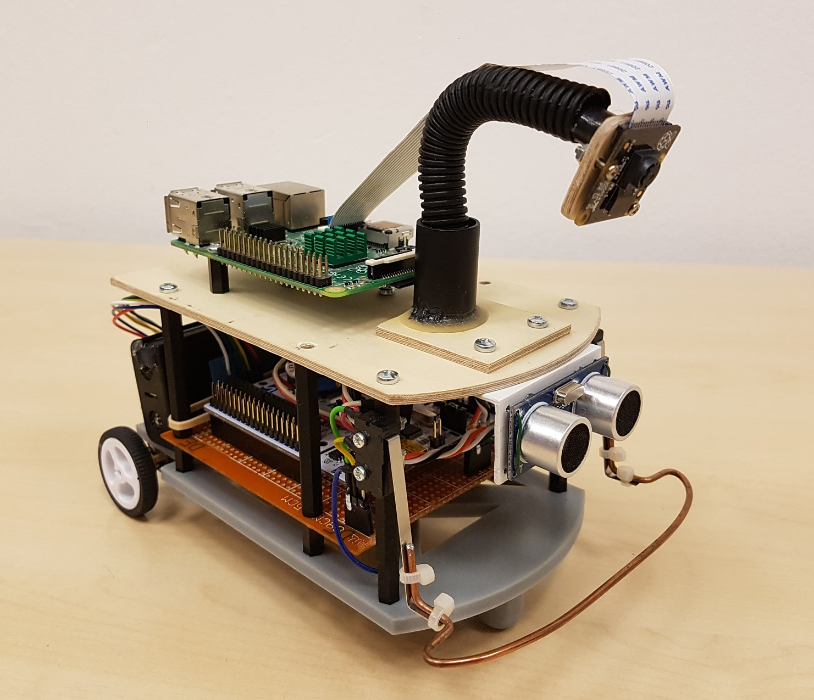

[Back](https://3zuli.github.io/)

# Robotics

## Swarm of Crazyflie 2.0 quadcopters
2016, Bachelor thesis, Internship at DLR Robotics and Mechatronics Center, Germany.

I created the basic infrastructure for control of a swarm of miniature semi-autonomous Crazyflie 2.0 quadcopters and for obtaining measurements from on-board sensors. A PD position controller and a new quaternion-based PD attitude controller were implemented in firmware. In addition, I implemented a set of programs for communicating with the quadcopters and for sending simple trajectories. The poses of all drones are measured with a Vicon motion tracking system. The quadcopters only receive their current position and a desired position setpoint. The quadcopters have the ability to detect collisions and landings and are capable of flight in turbulent airflow.

<iframe width="560" height="315" src="https://www.youtube.com/embed/LXng1v8lwbk" title="YouTube video player" frameborder="0" allow="accelerometer; autoplay; clipboard-write; encrypted-media; gyroscope; picture-in-picture" allowfullscreen></iframe>

## ADIS16488 IMU driver for Teensy 3.6
2017

Our university mobile robotics team was working on a four-wheeled robot, for which we wanted to integrate the highly precise (and very expensive) Analog Devices ADIS16488 9-axis IMU. I forked an existing [driver for ADIS16448](https://github.com/juchong/ADIS16448-Arduino-Teensy) and modified it for the ADIS16488. The code runs on a Teensy 3.6 board, which reads raw data from the IMU and streams it to the host PC. Other members of the team designed a PCB for the IMU and the Teensy and implemented a ROS node that received data from the Teensy.

[GitHub repository](https://github.com/3zuli/ADIS16488_regtest)

## PID motor control for differential drive robot
2018

This was a team project aimed at creating a line follower robot for the [Istrobot](http://www.robotika.sk/contest/) competition. My role was to develop the firmware for the STM32 processor, which performs low-level PID speed control of the drive motors.
- STM32F411, firmware developed with STM32 Cube IDE
- Two DC geared motors with hall effect encoders, ultrasonic sensor, front bumper switch
- Raspberry Pi uses camera to find the line and sends motion commands to the STM
- STM reads encoders with timers in encoder mode, performs a PID control loop for each motor, sends odometry and sensor states to RPi

[GitHub repository](https://github.com/3zuli/mprojbot)

[Project report](https://github.com/3zuli/mprojbot/blob/master/doc/MPROJ_robot_dokumentacia.pdf) (pdf, Slovak only)

## PID control of model gantry crane
2017

Assignment for our Mechatronic system control course. The project was realized using Matlab and Simulink. The work consisted of
- Performing system identification of the crane to create a simulation model
- Using the simulation model to design and tune a controller in simulation
- Using the developed controller to control the physical crane

<iframe width="560" height="315" src="https://www.youtube.com/embed/uhP8vmintfc" title="YouTube video player" frameborder="0" allow="accelerometer; autoplay; clipboard-write; encrypted-media; gyroscope; picture-in-picture" allowfullscreen></iframe>

## STM32 Line follower
2017

My own attempt at building a line follower robot for the [Istrobot 2017](http://www.robotika.sk/contest/2017/index.php) competition.
- STM32L152, firmware developed using [mbed.com](mbed.com)
- Line following with 9x CNY70 sensor (custom PCB) and PID control
- Ultrasonic sensor and front bumper switch for detecting obstacles
- Magnetometer for heading control while avoiding an obstacle

<iframe width="560" height="315" src="https://www.youtube.com/embed/kqh9bCNCvxU" title="YouTube video player" frameborder="0" allow="accelerometer; autoplay; clipboard-write; encrypted-media; gyroscope; picture-in-picture" allowfullscreen></iframe>

The actual line following worked pretty well. However, the robot was built using a cheap 2 wheel robot chassis kit and the motors weren't strong enough to climb the bridge on the competition track. 

<iframe width="560" height="315" src="https://www.youtube.com/embed/DYZh-zOFRCg" title="YouTube video player" frameborder="0" allow="accelerometer; autoplay; clipboard-write; encrypted-media; gyroscope; picture-in-picture" allowfullscreen></iframe>

<!-- # Research -->
<!-- circular avoidance -->

[Back](https://3zuli.github.io/)
